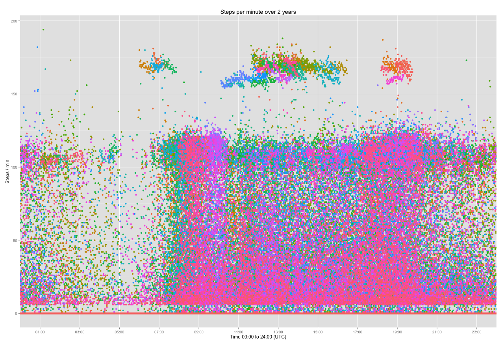

# BasisDataAnalysis

I have been using a Basis B1 and then a Basis Peak for the last 2 years.

[Basis](http://www.mybasis.com/) has promise an API from their early days but never published one. However, they implemented an [export functionality](https://support.mybasis.com/hc/en-us/articles/204142550-Exporting-Your-Data) that let you download a CSV dump of some data.

Using [R](https://www.r-project.org/), here is what I learnt from these data.

## Usage

You can use my R script to do the same basic analyze I have done:
```R
> source('basisData.R')
> basicData('bodymetrics.csv')
```

## The data

```R
> head(data)
                date calories        gsr heart.rate skin.temp steps
1  2013-07-28 00:00Z    1.206  3.4058700         57   93.2000     0
2  2013-07-28 00:01Z    1.200  3.6132000         53   93.2000     0
3  2013-07-28 00:02Z    1.200  3.6085500         55   93.2000     0
4  2013-07-28 00:03Z    1.381  4.3840100         57   93.2375     0
5  2013-07-28 00:04Z    1.264  4.0713400         55   93.2000     0
6  2013-07-28 00:05Z    1.200  3.2947900         55   93.0125     0
7  2013-07-28 00:06Z    1.591  5.0413300         58   92.9750     0
8  2013-07-28 00:07Z    1.456  5.6096600         65   93.2000     0
9  2013-07-28 00:08Z    1.442 10.7239000         56   93.2000     0
10 2013-07-28 00:09Z    1.200 12.0046000         52   93.2188     0
```
The export contains one line per minute, and for each minute a value for our Calories, Galvanic Skin Response (GSR), Heart rate, Skin temperature (ºF) and Steps.

## Analyze

I looked at my data between `2013-07-28 00:00` and `2015-07-27 23:59`. This is 730 days or 1,051,199 minutes.
However, my CSV dump contains 1,010,286 lines that being ~701 days.

I suppose this means that for ~29 days (40,913 minutes) my watch was out of battery and not recording anything - that’s an acceptable 3.9% of down time.

Then on the 96.1% of the time my tracker was working, I had to filter `NA` values, as I have not been wearing the watch while taking my shower, doing water activities, charging the battery and surely some hours where I forgot to put it back on my wrist.

For my heart pulse, I have 864,335 measures (82%), that’s 600 days.
My average value for this period is __66.15 beats per minute__. The min value is 30 bpm (seems quite low) and max value 206 bpm.

The sum of all my steps I have recorded for the period is __4,946,531 steps__. This is an average of 4.8 steps per minute over 701 days or 7,056 steps per day.

### Visualization
This is the first visualization of my data. On the `x` axis the time (24 hours) with minute granularity. On the `y` axis steps per minutes.



Each minute of the day are assign with the number of steps per minute I have made, over 701 days. Each day is represented by a color, nearest days have similar color. They also overlap each other so it creates density areas.

The groups detached at the top, around 170 steps per minute are my running sessions, more often happening in the afternoon than in the morning.

On the morning around 8:30, we have a very dense area which is my morning commute. My evening commute is less compact, but still around 19:00.

## Conclusion

This is a very small analyze due to the lack of API of retrieve of the data a Basis tracker is recording (sleep, running, ...).
I hope Basis will release an API to let us dive into more data.
